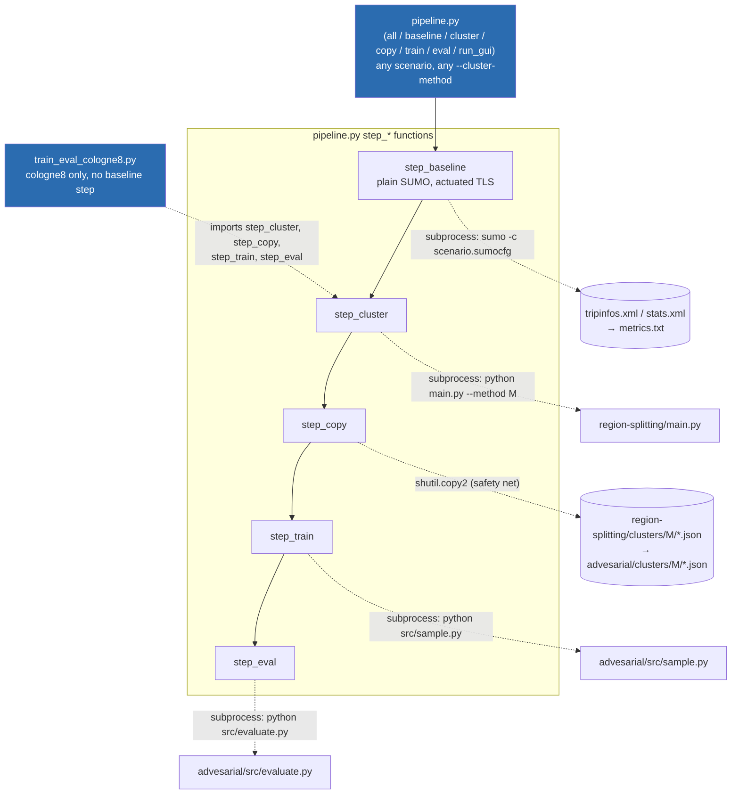
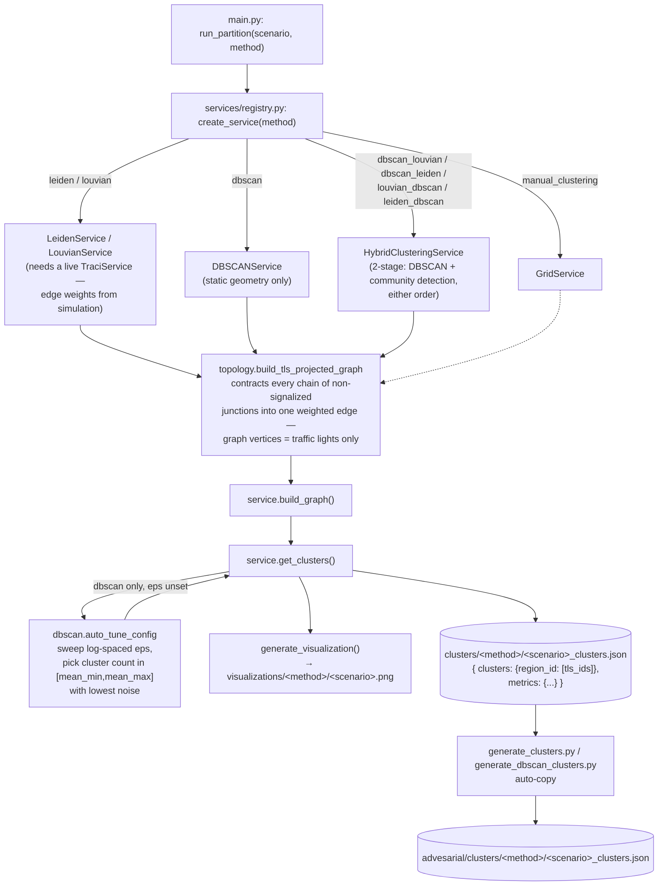
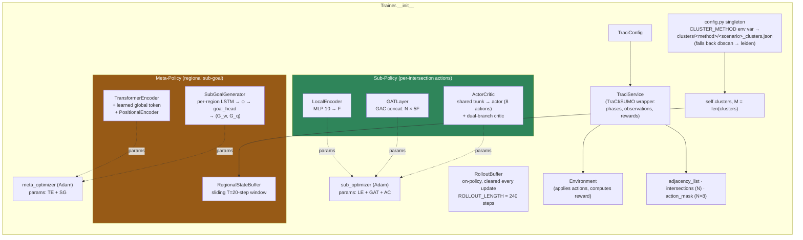
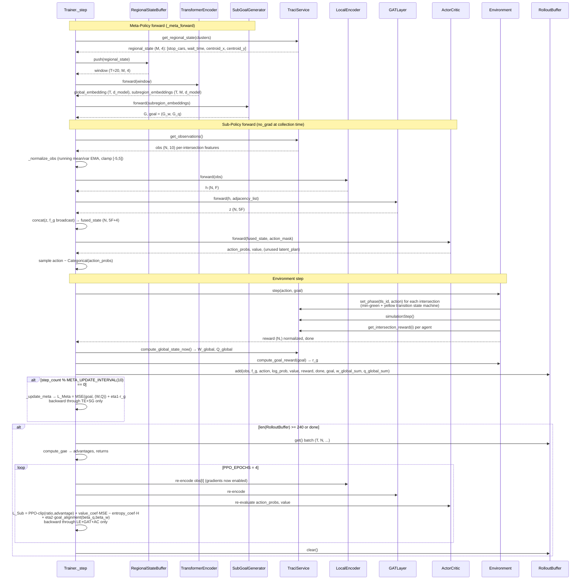
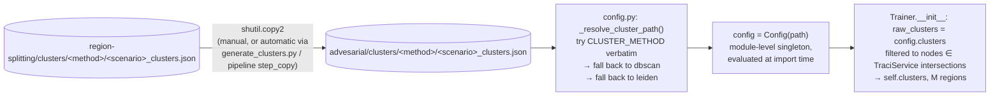

# Traffic HRL — High-Level Architecture Flow

Derived directly from the current code (not from `AGENTS.md` or `summary.md`, which
have drifted — see §6). Covers both modules end to end: `region-splitting/` →
cluster JSON → `advesarial/` → trained policy → evaluation metrics.

---

## 1. Repo-level orchestration

Two CLI entry points sit above both modules and drive them as subprocesses.
Neither is mentioned in `AGENTS.md`, but `pipeline.py` is the only place the
full 5-stage flow (baseline → cluster → copy → train → eval) is wired together.

**Why drawn this way:** `pipeline.py` passes scenario/method/episode config to
its children purely through environment variables (`TRAFFIC_SCENARIO`,
`CLUSTER_METHOD`, `TRAFFIC_EPISODES`, …) and `subprocess.run(cwd=...)` — there
is no shared Python import between `region-splitting` and `advesarial` at
runtime, which is why `AGENTS.md` correctly calls them "two independent
modules." `pipeline.py` is the seam that makes them act like one pipeline.

---

## 2. Module 1 — `region-splitting/`: network → cluster JSON

**Why drawn this way:** every service shares the same three-method interface
(`BaseClusteringService`), so the registry is a pure strategy-pattern switch —
the pipeline never branches on method name outside `registry.py`. The hybrid
services reuse the *same* DBSCAN primitives (`run_dbscan`, `auto_tune_config`)
as the standalone `DBSCANService` rather than re-implementing them, so a bug
fix in `dbscan.py` propagates to all four hybrid combinations automatically.
`topology.py` runs before every method (including DBSCAN, which otherwise
needs no graph) because DBSCAN still clusters node *coordinates* collected
from that same TLS-only graph — the graph isn't optional infrastructure, it's
the shared node universe every method partitions.

---

## 3. Module 2 — `advesarial/`: Trainer composition

`Trainer` (`advesarial/src/training/trainer.py`) is the de facto architecture
root — `sample.py`, `train.py` (now a thin compatibility wrapper, not broken —
see §6) and `evaluate.py` all just construct one and call its methods.

**Why drawn this way:** the two policy stacks are optimized completely
independently (two `Adam` instances, two loss functions) but share two
runtime objects — `TraciService` (the only source of simulation state for
both) and the per-step `goal`/`f_g` values that cross from Meta→Sub. That
cross-policy dependency is exactly what the sequence diagram in §4 traces.
Note `models/sub_policy.py` (`SubPolicy` class, exported from
`models/__init__.py`) implements the *same* encode→GAT→fuse logic that
`Trainer._encode_step` hand-rolls inline — `Trainer` never imports
`SubPolicy`. It's dead, duplicate code, not a second path through the system.

---

## 4. One training step — control & data flow

This is what `Trainer._step()` actually executes, called once per sim-second
inside `run_episode()`.

**Why drawn this way:** the two update branches are gated on *different*
clocks (`META_UPDATE_INTERVAL` vs `ROLLOUT_LENGTH`/episode-end) and backprop
through disjoint parameter sets — this is what actually enforces the
hierarchical/independent-optimizer design, not anything explicit elsewhere.
The PPO loop re-runs `LocalEncoder → GAT → ActorCritic` from raw `obs`/`f_g`
on every epoch (see `RolloutBuffer`'s docstring) specifically so gradients
reach `LocalEncoder`/`GAT` — storing the already-fused tensor instead would
silently freeze those two modules.

---

## 5. Cluster-JSON data contract (the only coupling between modules)

**Why drawn this way:** `config.py` runs `config = Config(_resolve_cluster_path())`
at **module import time**, not inside a function — so the cluster file is
locked in the moment anything does `from config import config/SCENARIO`,
before `argparse` in `sample.py`/`evaluate.py` even runs. `CLUSTER_METHOD`
and `TRAFFIC_SCENARIO` must therefore already be correct environment
variables *before* the interpreter starts, which is exactly why
`pipeline.py` sets them via `env=` on a fresh `subprocess.run` rather than
through in-process state.

---

## 6. Divergences found vs. the documented model (`AGENTS.md`, `summary.md`)

These were checked against the current code, not assumed from the docs:

| Documented claim | Current reality |
|---|---|
| "REINFORCE-style with 4 Adam optimizers" | **PPO-clip + GAE with 2 optimizers** (`sub_optimizer`, `meta_optimizer`); `training/adversarial.py`, `gae.py`, `rollout.py` implement this. No REINFORCE path exists. |
| "`train.py` is broken — `from agents import Actor` crashes" | `train.py` no longer imports `agents` at all; it's now a working thin wrapper around `training.Trainer`, identical in shape to `sample.py`. This bug appears **fixed**. |
| "`PhaseTracker.get_entropy()` calls `compute_phase_entropy()` without importing it — `NameError`" | `memory/phase_tracker.py` now imports it correctly from `utils`. Still **dead code** (never called in the training loop), but no longer a crash bug. |
| "`ReplayBufferItem` schema is unused" | Still true — `memory/replay_buffer.py::ReplayBuffer` (deque-based) is also unused; the actual training buffer is the unrelated `training/rollout.py::RolloutBuffer`. |
| Not mentioned | Root-level `pipeline.py` (375 lines) is the actual orchestrator tying both modules together end to end, plus a baseline-SUMO step neither module's own docs describe. |
| Not mentioned | `models/sub_policy.py::SubPolicy` and `agents/agent.py::Agent` / `environment/traffic_env.py::TrafficEnvironment` are unused stub/duplicate classes — `Trainer` reimplements `SubPolicy`'s logic inline rather than using it. |

**Implication:** `AGENTS.md`'s architecture section (optimizer count, training
algorithm) is stale relative to `clustering-approaches` branch HEAD. The
PPO/GAE rewrite is a substantial behavioral change (clipped policy updates,
advantage normalization, multi-epoch reuse of rollouts) that isn't reflected
in the checked-in instructions — worth a follow-up doc update if this branch
merges.
