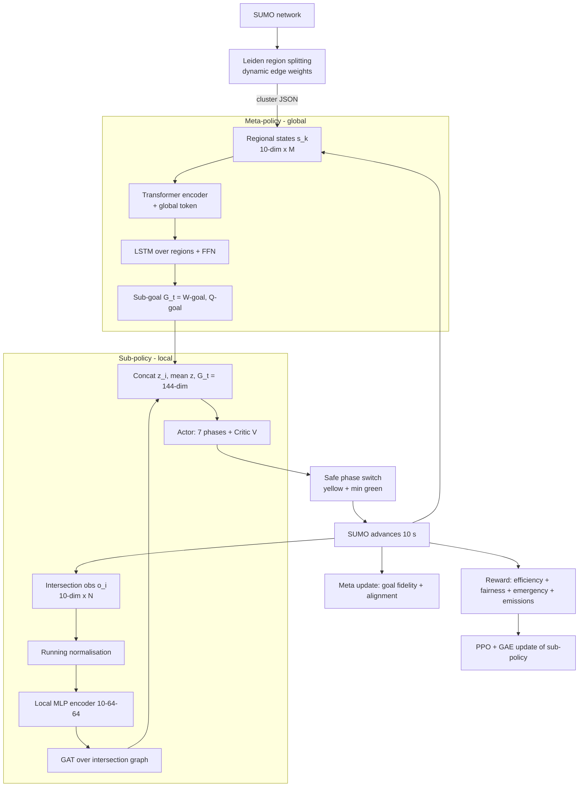

# Fairness-Aware Hierarchical Reinforcement Learning for Adaptive Traffic Signal Control

*Report on the current implementation (`advesarial/` + `region-splitting/`), scenario `cologne8`, SUMO/TraCI.*

**Contents**

1. [Proposed Work](#1-proposed-work)
   1.1 Overall idea · 1.2 Fairness stressed from the introduction · 1.3 Mathematical model · 1.4 Architecture flow · 1.5 Steps
2. [Reward Design (reformatted)](#2-reward-design-reformatted)
3. [Fairness](#3-fairness)
4. [Results and Discussion](#4-results-and-discussion)
5. [Conclusion and Future Work](#5-conclusion-and-future-work)
6. [Appendix: implementation notes and caveats](#appendix-implementation-notes-and-caveats)

> **Reading note.** Everything below is derived from the code and logs in this repository. Where a claim could not be backed by an experiment that was actually run (e.g. reward-weight ablations), the report says so and states the reasoning instead of inventing numbers. `summary.md` / `README.md` in the repo are partly stale (they describe REINFORCE; the code now uses PPO), so the code was taken as the source of truth.

---

## 1. Proposed Work

### 1.1 Overall idea

We control the traffic signals of an urban network with a **two-level (hierarchical) multi-agent RL system** that is explicitly **fairness-aware**:

1. **Region splitting.** The road network is treated as a weighted graph whose edge weights come from live traffic (vehicle count, waiting time, congestion). The **Leiden** community-detection algorithm partitions it into regions (clusters) of strongly interacting roads (modularity of the `cologne8` partition: 0.624).
2. **Meta-policy (global, slow view).** A **Transformer encoder** reads one 10-dimensional state per region plus a learnable global token. An **LSTM + feed-forward head** turns the encoded regions into a **sub-goal vector** `G_t` — the network-wide waiting-time / queue-length picture the local controllers should be aware of.
3. **Sub-policy (local, fast control).** Each intersection encodes its own 10-dimensional observation with an MLP, exchanges information with neighbouring intersections through a **Graph Attention (GAT) layer**, concatenates a network-mean feature and the sub-goal, and an **actor-critic** head picks the next signal phase. Training is **PPO with GAE**.
4. **Multi-objective, fairness-aware reward.** A single shared reward combines efficiency, **fairness**, emergency-vehicle priority and emissions (stops), then standardises it online.

The design follows the HiLight hierarchical-RL framework (reference paper in `papers/`), extended with the fairness machinery and the region-splitting front end.

### 1.2 Fairness stressed from the introduction

*Suggested framing for the paper's introduction (this is the stress the work puts on fairness):*

Most RL signal controllers minimise an **aggregate** — total queue, total delay, average travel time. An aggregate can be improved by **sacrificing a minority**: giving a busy approach permanent green shortens the average wait while a side street, a pedestrian crossing or a distant district starves. Average delay therefore hides exactly the cases that matter to road users and to city operators: the **vehicle that waits several minutes**, the **intersection that always pays for its neighbour's throughput**, and the **pedestrian who is never served**.

This work treats fairness as a **first-class design objective, not a post-hoc metric**:

- fairness enters the **reward** (variance of waiting times, a hard starvation cap, Jain's index, an envy term, pedestrian waiting and conflicts);
- the **meta-policy** gives every controller the same network-wide picture (`G_t`), so local greed is tempered by global context;
- the **graph attention** lets an intersection see how loaded its neighbours are before deciding.

### 1.3 Mathematical model

**Network and regions.** Let the road network be a graph $\mathcal G=(\mathcal V,\mathcal E)$ and $\mathcal I=\{1,\dots,N\}$ the signalised intersections ($N=8$ in `cologne8`). Leiden finds a partition $\mathcal C=\{C_1,\dots,C_M\}$ maximising modularity on edge weights

$$
w_e = \alpha\, n_e + \beta\, \omega_e + \gamma\, \kappa_e\, n_e,\qquad (\alpha,\beta,\gamma)=(1.0,\,0.3,\,2.0),
$$

where $n_e$ is the vehicle count, $\omega_e$ the waiting time and $\kappa_e=\mathrm{clip}(1-\bar v_e/v_e^{\max},0,1)$ the congestion ratio of edge $e$, averaged over 1000 simulation steps.

**Observations.**

- Local (per intersection, 10-dim): $o_i=[\text{vehicles, queue, occupancy, flow, stops, waiting time, mean speed, pressure, congestion ratio, delay}]$. It is standardised with an exponential-moving-average (EMA, $\alpha_n=0.01$) mean/variance and clipped:
  $\hat o_i=\mathrm{clip}\big((o_i-\mu)/(\sigma+\epsilon),-5,5\big)$.
- Regional (per cluster, 10-dim): $s_k=[\text{occupancy-sum, mean wait, vehicle count, mean speed, in-flow, out-flow, net flow, pressure, congestion ratio, phase entropy}]$.

**Meta-policy $\pi_H$.** With $x_k=W_{in}s_k$ and a learnable global token $g_0$:

$$
[h_g,h_1,\dots,h_M]=\mathrm{Transformer}\big([g_0;x_1;\dots;x_M]+\mathrm{PE}\big),\qquad
u_{1:M}=\mathrm{LSTM}(h_{1:M}),
$$
$$
G_t=\mathrm{FFN}\big([u_1\Vert\cdots\Vert u_M\Vert h_g]\big)\in\mathbb R^{2N},\qquad G_t=[G^W_t,\;G^Q_t].
$$

(6 pre-LN layers, 8 heads, $d_{model}=128$, sinusoidal positional encoding, LSTM hidden size 128.) $G^W_t,G^Q_t$ are the goal for per-intersection waiting time and queue length.

**Sub-policy $\pi_L$.**

$$
z_i=\mathrm{MLP}(\hat o_i)\in\mathbb R^{64},\qquad
e_{ij}=\mathrm{LeakyReLU}_{0.2}\big(a^\top[z_i\Vert z_j]\big),\quad
\alpha_{ij}=\frac{\exp e_{ij}}{\sum_{k\in\mathcal N(i)}\exp e_{ik}},\quad
z_i'=z_i+\sum_{j\in\mathcal N(i)}\alpha_{ij}z_j,
$$
$$
s_i=\big[z_i'\;\Vert\;\tfrac1N\textstyle\sum_j z_j'\;\Vert\;G_t\big]\in\mathbb R^{144},\qquad
\pi_\theta(a_i\mid s_i)=\mathrm{softmax}\big(W_a\,\mathrm{ReLU}(W_1 s_i)\big),\quad V_\phi(s_i)=W_v\,\mathrm{ReLU}(W_2 s_i).
$$

$\mathcal N(i)$ = intersections joined by a road edge. The actor has 7 outputs; the chosen index is mapped to a valid green phase of that intersection (`index mod |phases|`).

**Reward.** One shared scalar per control step (details in §2):

$$
R_t=\lambda_E R^{eff}_t+\lambda_F R^{fair}_t+\lambda_M R^{emg}_t+\lambda_X R^{emi}_t,\quad
(\lambda_E,\lambda_F,\lambda_M,\lambda_X)=(0.4,\,0.2,\,0.3,\,0.1),\qquad
\tilde r_t=\frac{R_t-\mu^R_t}{\sigma^R_t+\epsilon}.
$$

**Sub-policy objective (PPO).** With $\delta_t=\tilde r_t+\gamma V(s_{t+1})-V(s_t)$, $\hat A_t=\sum_{l\ge0}(\gamma\lambda)^l\delta_{t+l}$ ($\gamma=0.99,\lambda=0.95$), advantages standardised per batch, and $\rho_t=\pi_\theta/\pi_{\theta_{old}}$:

$$
\mathcal L_L=-\mathbb E\big[\min(\rho_t\hat A_t,\;\mathrm{clip}(\rho_t,1\!\pm\!0.2)\hat A_t)\big]
+1.0\cdot\mathbb E\big[(V_\phi-\hat R_t)^2\big]-0.01\cdot\mathbb E[\mathcal H(\pi_\theta)].
$$

**Meta objective.** With $W_t,Q_t$ the running-normalised per-intersection waiting times and queue lengths, $r_g=-(\beta_1\sum W^{raw}+\beta_2\sum Q^{raw})$ and $\beta_1=\beta_2=0.1$:

$$
\mathcal L_H=\underbrace{\|G_t-[W_t,Q_t]\|^2_{MSE}}_{\text{goal fidelity}}+\eta_1\,\overline{r_g}
+\eta_2\Big(\beta_1\|W_t-G^W_t\|^2+\beta_2\|Q_t-G^Q_t\|^2\Big),\qquad\eta_1=\eta_2=0.1 .
$$

### 1.4 Architecture flow



```
 region-splitting/                         advesarial/  (per 10 s control step)
 ┌──────────────────┐   cluster JSON   ┌─────────────────────────────────────────────┐
 │ SUMO net → graph │ ───────────────► │ cluster states → Transformer → LSTM → G_t   │
 │ Leiden clusters  │                  │ intersection obs → MLP → GAT ─┐             │
 └──────────────────┘                  │                     [z', mean z', G_t]      │
                                       │                              ▼              │
                                       │ Actor-Critic → phase → safe switch → SUMO   │
                                       │                              ▼              │
                                       │ reward (eff/fair/emg/emi) → PPO / meta loss │
                                       └─────────────────────────────────────────────┘
```

### 1.5 Steps

**Offline (once per network)**

1. Load the SUMO network, run 1000 steps and average the dynamic edge weights.
2. Run Leiden, merge singleton communities into the best neighbour, save `clusters/leiden/<net>_clusters.json` (clusters + modularity + per-cluster internal/external ratio).

**Online – one training episode (3600 s = 360 control steps of 10 s)**

3. Read regional states $s_k$ → Transformer → LSTM → sub-goal $G_t$ (detached before use by the sub-policy).
4. Read intersection observations, normalise, encode with the MLP, aggregate with the GAT, build the 144-dim state with $G_t$.
5. Sample one phase per intersection from the actor; apply it through the **safe switching** layer (green → yellow → target green, minimum-green timer).
6. Advance SUMO 10 s; compute the multi-objective reward and standardise it; store observations, sub-goals, actions, log-probs, values, rewards and the meta target $[W_t,Q_t]$.
7. At episode end: compute GAE; run **10 PPO epochs** over mini-batches of 60 time-steps (clip 0.2, entropy 0.01, Adam 3e-4, gradient clip 10).
8. Update the meta-policy (Transformer + sub-goal generator) on the whole episode in one vectorised step.
9. Save a checkpoint (`models/run_<timestamp>/`), restart SUMO, repeat. Optional auto-evaluation every 25 episodes.

**Evaluation**

10. Greedy (arg-max) policy, 360 steps over the window 25 200–28 800 s; record queue, per-vehicle waiting/travel/delay time, completed vehicles, peak queue.

---

## 2. Reward Design (reformatted)

### 2.1 Structure

$$
\boxed{R_t = 0.4\,R^{eff}_t \;+\; 0.2\,R^{fair}_t \;+\; 0.3\,R^{emg}_t \;+\; 0.1\,R^{emi}_t},\qquad
\tilde r_t=\frac{R_t-\mu^R_t}{\sqrt{\sigma^{R\,2}_t}+10^{-8}}
$$

$\mu^R_t,\sigma^{R\,2}_t$ are EMA estimates ($\alpha=0.01$). The reward is **shared by all intersections** (cooperative setting); per-intersection credit comes only from each intersection's own value baseline.

### 2.2 Components at a glance

| Block | Weight $\lambda$ | Intent | Signal (from TraCI) | Active in `cologne8`? |
|---|---|---|---|---|
| **Efficiency** $R^{eff}$ | 0.4 | Move vehicles, reduce queues and waiting | per-intersection local reward + network Δqueue / Δwait | Yes |
| **Fairness** $R^{fair}$ | 0.2 | Equitable service across vehicles, intersections, pedestrians | wait-time variance, max wait, Jain index, envy, pedestrian wait/conflicts | Partly (vehicle terms only) |
| **Emergency** $R^{emg}$ | 0.3 | Fast passage for emergency vehicles | summed waiting time of vehicles of type `emergency` | No (no such vehicles in the route file) |
| **Emission** $R^{emi}$ | 0.1 | Fewer stop-and-go events | count of vehicles with speed < 0.1 m/s on incoming lanes | Yes |

### 2.3 Efficiency

$$
R^{eff}_t=-\big(\beta_1\,\Delta Q_t+\beta_2\,\Delta W_t\big)+\frac1N\sum_{i}r^{loc}_i,\qquad
r^{loc}_i=-\big(\text{veh}_i+W_i+p_i-\bar v_i\big)
$$

$\Delta Q_t=Q_{t-1}-Q_t$, $\Delta W_t=W_{t-1}-W_t$ (network totals), $\beta_1=\beta_2=0.1$, $p_i$ = pressure, $\bar v_i$ = mean speed on the lanes of intersection $i$.

### 2.4 Fairness

$$
R^{fair}_t=-\Big(0.3\,\mathrm{Var}(w)+0.25\,\max(w_{max}-90,0)+0.15\,(1-J)+0.5\,\mathrm{Envy}+0.5\,w^{ped}_{max}+1.2\,N_{conf}\Big)
$$

See §3 for the meaning and role of each term.

### 2.5 Emergency and emission

$$
R^{emg}_t=-\sum_i W^{emg}_i,\qquad R^{emi}_t=-\sum_i \mathrm{Stops}_i
$$

### 2.6 Why this layout

- The four blocks have **separate, interpretable purposes** and a single place to tune each ($\lambda$).
- Fairness has its **own block** instead of being folded into efficiency, so its influence can be ablated or scaled independently.
- Final z-score normalisation keeps the advantage scale stable even though the raw blocks differ by orders of magnitude (§4.3).

---

## 3. Fairness

### 3.1 What "fair" means here

Fairness is measured at three levels, each with its own term:

| Level | Question | Term |
|---|---|---|
| **Between vehicles** | Do some drivers wait far longer than others? | variance of waiting time, Jain's index, max-wait cap |
| **Between intersections** | Does one junction pay for another's throughput? | envy |
| **Between road-user classes** | Are pedestrians (and emergency vehicles) served? | pedestrian wait, pedestrian–vehicle conflicts, emergency block |

### 3.2 Term-by-term

Let $w$ be the pooled waiting times of all non-emergency vehicles on incoming lanes of all intersections.

| Term | Definition | Weight | Role |
|---|---|---|---|
| Wait variance | $\mathrm{Var}(w)$ | 0.30 | Penalises *dispersion*: pushes the controller towards evening out waits, not only lowering the mean. |
| Max-wait penalty | $\max(w_{max}-90,\,0)$ | 0.25 | Hard **anti-starvation** rule. Zero below 90 s, linear above, so a single abandoned approach is always visible. |
| Jain's index | $J=\dfrac{(\sum w)^2}{n\sum w^2}\in(0,1]$, penalty $1-J$ | 0.15 | Scale-free equity measure (1 = perfectly equal). Bounded, so it complements the unbounded variance term. |
| Envy | $\max_j u_j-u_i$, $u_i=-(W_i+0.5\,n_i)$ | 0.50 | Cross-intersection equity: penalises an intersection whose utility is far below the best one. |
| Pedestrian wait | $\max_p w^{ped}_p$ | 0.50 | Keeps crossings served. |
| Pedestrian conflicts | number of vehicle–pedestrian collisions | 1.20 | Largest weight: a safety event, treated as near-forbidden. |

All of $R^{fair}$ then enters the total with $\lambda_F=0.2$.

### 3.3 Fairness beyond the reward

- **Global sub-goal $G_t$** gives each local agent the network-wide picture, so local decisions are not made in isolation.
- **GAT neighbour attention** lets an intersection weigh how congested adjacent junctions are.
- **Regional (cluster) structure** keeps the meta-policy aware of *where* load accumulates, not just how much.
- **Safe phase switching** (yellow + minimum green) prevents unfair rapid flipping that starves a movement.

### 3.4 Benefits

1. **No hidden victims.** Variance, max-wait and Jain together expose the tail of the delay distribution that mean-delay metrics hide.
2. **Starvation is bounded.** The 90 s cap gives a predictable worst-case service level.
3. **Equity across space.** Envy discourages sacrificing one junction for network-level numbers.
4. **Multi-class road users.** Pedestrian and emergency terms put non-car users in the objective.
5. **Complementary, not redundant, terms.** Variance (unbounded, scale-sensitive), Jain (bounded, scale-free), max-wait (worst case) and envy (spatial) each cover a failure mode the others miss.
6. **Tunable trade-off.** One coefficient ($\lambda_F$) trades efficiency against equity, and each fairness term can be switched off for ablation.

---

## 4. Results and Discussion

### 4.1 Experimental setting

| Item | Value |
|---|---|
| Simulator / scenario | SUMO + TraCI, `cologne8` benchmark network |
| Signalised intersections $N$ | 8 |
| Regions $M$ | 8 (the Leiden file has 15 communities; only those containing a signalised junction are kept) |
| Demand | 2 046 car trips in the route file (single vehicle type `pkw`); 1 995 complete the trip under the fixed-time plan. Window 25 200–28 800 s |
| Control interval | 10 s (360 decisions per episode) |
| Actions / state / sub-goal | 7 phases / 144-dim / 16-dim |
| Optimiser | Adam, lr 3e-4 for every module; PPO clip 0.2, 10 epochs, 60-step mini-batches |
| Evaluation | Greedy policy, 360 steps, full hour |

### 4.2 Results

Evaluation snapshots logged in `metrics.txt` (Aug 2–4, 2026), against the **fixed-time controller** measured from SUMO's own trip records (`scenarios/cologne8/tripinfos_base.xml`).

| Run | Completed veh. | Avg queue (halted) | Avg waiting (s) | Avg travel time (s) | Avg delay (s) | Peak queue |
|---|---|---|---|---|---|---|
| **Fixed-time baseline (SUMO tripinfo)** | **1 995** | – | 29.27 | **114.39** | 49.26 (time loss) | – |
| run_20260802_121029 ¹ | 1 033 | 736.95 | 14.14 | 204.68 | 153.51 | 1 309 |
| run_20260802_121513 ¹ | 1 056 | 720.00 | 13.66 | 204.49 | 152.56 | 1 298 |
| run_20260802_140914 ¹ | 1 337 | 503.30 | 14.04 | 213.59 | 150.84 | 747 |
| run_20260802_163314 | 1 959 | 183.89 | 34.59 | 211.31 | 146.75 | 383 |
| **run_20260804_083347 (best)** | 1 806 | **154.14** | **22.45** | 144.99 | **83.76** | **375** |
| run_20260804_135319 | 1 882 | 267.37 | 26.08 | 205.14 | 140.67 | 406 |
| run_20260804_180747 | 1 847 | 408.21 | 27.77 | 337.76 | 270.89 | 740 |
| run_20260804_191709 | 1 981 | 185.68 | 28.01 | 221.74 | 153.62 | 443 |

¹ These three were logged with 3 600 evaluation steps (the older 1-s control cadence; `eval_old_model_10s.py` exists because `0802_140914` was a pre-sub-goal checkpoint), not the 360 steps at 10 s used for the other rows, so they are not strictly comparable.

Reading the table honestly:

- **Progress over development.** The early runs (121029, 121513) are close to gridlock — about half of the demand completes and the queue exceeds 700 vehicles. Later runs complete 1 800–1 980 vehicles with queues of 150–270. The best run (`0804_083347`) has the lowest queue, waiting time and delay of all learned runs.
- **Not yet better than fixed-time on trip time.** The best learned run's travel time is 145 s versus 114 s for the fixed-time plan (+27 %), and it completes 9.5 % fewer vehicles (1 806 vs 1 995). Its waiting time (22.5 s vs 29.3 s, −23 %) looks better, but see the caveat below. **The current evidence does not support a claim that the learned controller beats fixed-time.**
- **High variance between runs.** Travel time ranges from 145 s to 338 s across the last four runs, which points to unstable training and/or differing code versions; seeds and configuration per run are not recorded.
- **Metric caveat.** The baseline comes from SUMO's trip records; the learned runs are measured by `evaluate.py` (travel time from first observation, delay against free-flow time, and TraCI's *accumulated* waiting time, which is windowed). The two instruments are close but **not identical**, so the comparison is indicative only. The next step should be to run the fixed-time plan through `evaluate.py` itself.
- **Training curves.** The earliest logs (Apr 2026, pre-PPO) show actor-critic loss blowing up from ≈ 258 to > 129 000 and persistently negative rewards. The Aug 2026 snapshots show losses staying O(1), but the reward (whose scale changed between code versions) still fluctuates strongly, so stability improved while learning is not yet convincingly monotonic. The logs do not isolate which change (PPO, GAE, normalisation) caused the improvement.

### 4.3 Why the elements matter

> **Important:** no ablation study has been run in this repository. The points below explain the *role* of each element from the formulation and the scale of the quantities involved; the **proposed ablations** at the end of this section are what is needed to confirm them quantitatively.

**Reward-weight selection $(\lambda_E,\lambda_F,\lambda_M,\lambda_X)=(0.4,0.2,0.3,0.1)$.**
- Because the reward is a *weighted sum before normalisation*, the weights set the **relative pull** of each objective. Efficiency is deliberately the largest (0.4): without it the agent can minimise any penalty by just not moving traffic.
- Emergency (0.3) is high because it is *rare but critical*: a single emergency vehicle waiting 60 s must be able to move the reward even when thousands of ordinary vehicles contribute.
- Emission (0.1) is lowest: stop count is strongly correlated with queue and waiting time already in $R^{eff}$, so a large weight would double-count congestion.
- Fairness (0.2) is intentionally a regulariser rather than the leading term: too large and the agent equalises *misery* (everyone waits equally long); too small and it behaves like a pure throughput maximiser.
- In `cologne8` the emergency block and the pedestrian terms are **identically zero** (the route file has only `pkw` cars and no persons), so the 0.3 emergency weight currently has no effect and the effective trade-off is efficiency vs. vehicle-fairness vs. stops.

**Fairness weights $(0.3,0.25,0.15,0.5,0.5,1.2)$.**
- The weights are on **different physical scales**, so they are not comparable by their numbers alone. As an illustration (not a measurement): if pooled waits have a standard deviation of 30 s, $0.3\,\mathrm{Var}(w)\approx270$, whereas the Jain term can never exceed 0.15. Variance therefore dominates unless the other terms trigger; Jain mostly acts as a small bounded tie-breaker. The z-score normalisation of the total hides this from the optimiser but not from the *relative* weighting inside $R^{fair}$.
- The **90 s threshold** makes max-wait a *conditional* term: silent in normal operation, strong exactly when someone is being starved.
- The **largest weight (1.2) is on conflicts** by design — a safety event should dominate any efficiency gain.

**Normalisation (reward and state).** Raw queues are in the hundreds and waiting times in the thousands. Without standardisation the critic would regress onto targets of very different scales; the earliest (pre-standardisation) logs show the loss exploding, and later logs stay bounded, although the logs do not isolate normalisation as the cause.

**Sub-goal $G_t$ and the meta-policy.** $G_t$ is the only channel through which global information reaches the local policy. It is trained to reproduce the (normalised) network waiting-time / queue picture, so it acts as a learned, compressed network summary. Note that in the current code $G_t$ is detached for PPO, so the meta-policy is trained only by the goal-fidelity and alignment losses, not by the reward (see Appendix).

**GAT.** Lets each controller condition on neighbours' state with learned (attention) weights instead of treating junctions independently; it matters most for coordination along corridors.

**Safe switching (yellow + minimum green).** Prevents the agent from flipping phases every step, which is both unsafe and inherently unfair to the movements that lose the green.

**Region splitting.** Provides the meta-policy with a structured, low-dimensional view (M regions rather than all edges) and keeps strongly coupled roads together; modularity 0.624 indicates a meaningful partition.

**Proposed ablations (to be run).**

| Experiment | Purpose |
|---|---|
| $\lambda_F\in\{0,0.1,0.2,0.4\}$ with efficiency fixed | Efficiency–fairness trade-off curve; report Jain index, p95/max waiting time alongside the mean |
| Each fairness term removed in turn | Which term actually reduces the tail of the wait distribution |
| Vary the 90 s starvation threshold (60/90/120 s) | Sensitivity of worst-case service |
| $\lambda_E,\lambda_X$ sweeps; a scenario that actually contains emergency vehicles and pedestrians | Validate the emergency / pedestrian weights, currently untested |
| With / without sub-goal $G_t$; with / without GAT | Contribution of the hierarchy and of neighbour attention |
| Multiple seeds, and fixed-time + max-pressure baselines through the same evaluator | Statistical significance and a fair comparison |

---

## 5. Conclusion and Future Work

We presented a hierarchical, fairness-aware RL controller that combines Leiden region splitting, a Transformer/LSTM meta-policy producing a network sub-goal, and a GAT-based PPO sub-policy trained on a reward with explicit efficiency, fairness, emergency and emission blocks. The implementation trains with bounded losses under PPO and shows improvement over its own early versions, but on `cologne8` it does not yet outperform the fixed-time baseline on travel time.

**Future work.** (i) Run reward-weight and fairness ablations with multiple seeds and report fairness metrics (Jain index, p95/max wait) against fixed-time and max-pressure baselines; (ii) test on scenarios with emergency vehicles, pedestrians and more intersections, and train the meta-policy from the task reward.

---

## Appendix: implementation notes and caveats

Findings from reading the code that affect how results should be interpreted (none were changed as part of this report).

| # | Where | Observation | Impact |
|---|---|---|---|
| 1 | `environment.py` `_compute_reward` | $R^{eff}$ uses $-(\beta_1\Delta Q+\beta_2\Delta W)$ with $\Delta=\text{prev}-\text{now}$, so a *reduction* in queue/wait yields a *negative* contribution. The per-intersection `local_reward` term has the correct sign and dominates in magnitude. | The network-delta part of the efficiency reward is sign-inverted. |
| 2 | `environment.py` | Envy uses `my_utility`, which is the utility of the **last** intersection in the loop (the `current_intersection` check is commented out), not each agent's own. | Envy is currently "best utility minus last junction's utility", shared by all agents — not a per-agent envy signal. |
| 3 | `environment.py` `compute_jain_index` | Returns 0 when all waits are 0, so the Jain penalty $(1-J)$ is 0.15 even when nobody waits (perfect fairness). | Small constant bias in empty/free-flow conditions. |
| 4 | `traci.py` `total_queue_length` | Uses `getLastStepVehicleNumber` (vehicle count), not halting vehicles. | "Queue" in the reward and envy utility is really vehicle count on controlled lanes. |
| 5 | `traci.py` `get_cluster_states` | Cluster members are junction IDs, but most features are read only if the ID is an *edge* ID; for `cologne8` that never holds, so only the `pressure` feature is non-zero. The phase-entropy feature is computed from an empty history (the history is never updated). | The meta-policy currently sees an almost-empty regional state; the benefit of the hierarchy is therefore not yet demonstrated. |
| 6 | `cologne8` clustering | After filtering to signalised junctions every one of the 8 regions contains exactly one intersection. | Region structure is degenerate for this network; a larger network would exercise it properly. |
| 7 | `sample.py` | The sub-goal passed to the sub-policy is `.detach()`ed and `η₁·mean(r_g)` carries no gradient (rewards are constants). | The meta-policy is trained by supervised goal-fidelity only, not by RL return. |
| 8 | Scenario | The route file has no `emergency` vehicles and no pedestrians. | $R^{emg}$ and the pedestrian terms are zero in all reported results. |
| 9 | `traci.py` | `min_green_time = yellow_time = 1` decision step = 10 s of simulated time. | Minimum green and yellow are 10 s each at the current cadence. |
| 10 | Logs | `metrics.txt` does not record the code version, seed or hyper-parameters of each run; runs span several architectural changes. | Run-to-run comparison in §4.2 is a development trajectory, not a controlled experiment. |
| 11 | Docs | `README.md` / `summary.md` still describe REINFORCE, 4 optimisers and older reward weights/hyper-parameters. | Use the code (PPO, 5 Adam optimisers at 3e-4) as the reference. |

### Source map

| Topic | File |
|---|---|
| Training loop, PPO, GAE, meta update | `advesarial/src/sample.py` |
| Reward and fairness | `advesarial/src/environment/environment.py` |
| TraCI observations, safe switching, fairness signals | `advesarial/src/services/traci.py` |
| Meta-policy | `advesarial/src/models/encoder/transformer.py`, `models/lstm.py` |
| Sub-policy | `models/encoder/local.py`, `models/gat.py`, `agents/actor.py` |
| Evaluation | `advesarial/src/evaluate.py`, `verify_harness_10s.py` |
| Region splitting | `region-splitting/services/leiden.py`, `services/traci.py` |
| Results log | `metrics.txt`, `scenarios/cologne8/tripinfos_base.xml` |
